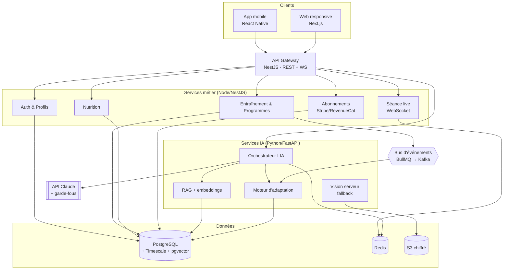
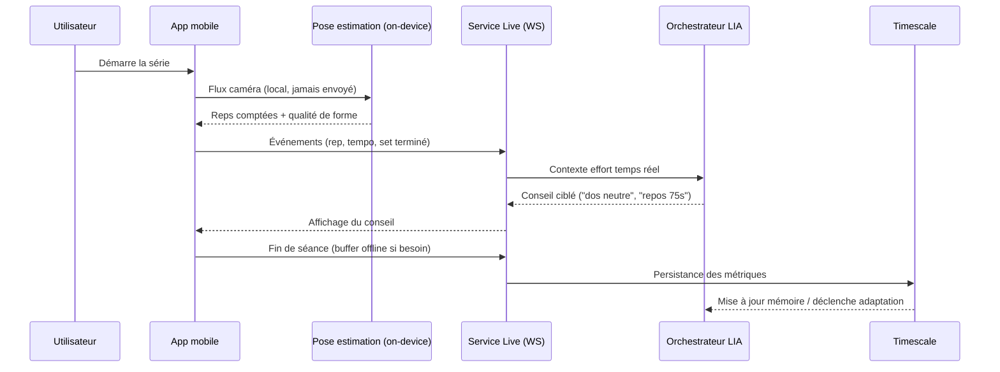
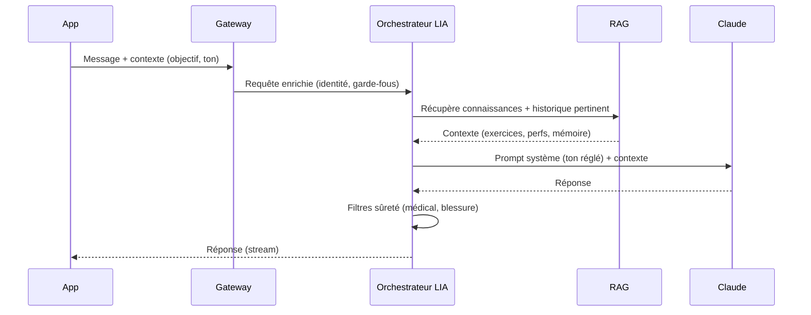

# 02 — Architecture système

> Statut : 🟡 cible · Voir aussi `01-stack-technique.md`, `05-ia-lia.md`

---

## 1. Vue d'ensemble (C4 — niveau conteneurs)

> Le **comptage de répétitions** s'exécute **on-device** (pose estimation). Le service `VISION` serveur n'est qu'un *fallback* (appareils faibles, analyses fines a posteriori) et reste optionnel.

---

## 2. Principes architecturaux

1. **Modulaire orienté domaine** — on démarre en **monolithe modulaire** (NestJS, modules isolés) plutôt qu'en micro-services prématurés. On n'extrait un service que sous contrainte réelle (charge, équipe, cycle de déploiement).
2. **L'IA est isolée** — les services Python sont un *bounded context* à part : sécurité, scaling et coûts différents du métier.
3. **Event-driven là où ça compte** — fin de séance, nouveau record, inactivité → événements qui déclenchent adaptation du programme, notifications, recalcul de la mémoire LIA.
4. **Offline-first sur la séance** — le moment critique (l'entraînement en salle, réseau faible) ne dépend pas du backend.
5. **Idempotence & traçabilité** — toute écriture sensible est idempotente et auditée (voir `06`/`07`).

---

## 3. Flux critiques

### 3.1 Séance live (cœur produit)

**Points clés :**
- Le **flux vidéo ne quitte jamais l'appareil** → vie privée + latence (voir `06`).
- Si le réseau tombe, l'app **bufferise** les événements et synchronise plus tard.
- Les conseils LIA en séance sont **majoritairement pré-calculés / à base de règles** (latence) ; le LLM intervient pour la nuance et le ton, de façon asynchrone.

### 3.2 Chat LIA (asynchrone, RAG)

### 3.3 Adaptation du programme (event-driven)

Déclencheur : fin de séance / plateau détecté / retour d'effort (RPE).
→ `RECO` recalcule charges, volume et repos pour les prochaines séances → propose, l'utilisateur valide → versionne le programme.

---

## 4. Découpage en domaines (bounded contexts)

| Domaine | Responsabilité | Données maîtresses |
|---------|----------------|--------------------|
| **Identity** | Comptes, profils, consentements | `users`, `consents` |
| **Training** | Exercices, programmes, séances, sets | `programs`, `workouts`, `sets` |
| **Telemetry** | Séries temporelles, capteurs, santé | hypertables Timescale |
| **LIA** | Conversations, mémoire, recommandations | `conversations`, `lia_memory`, `recommendations` |
| **Nutrition** | Repas, macros, objectifs | `meals`, `nutrition_targets` |
| **Billing** | Abonnements, droits, paiements | `subscriptions`, `entitlements` |
| **Engagement** | Notifications, séries (streaks), succès | `streaks`, `achievements` |

---

## 5. Stratégie offline & synchronisation

- **Source de vérité locale** pendant la séance (SQLite/MMKV sur l'appareil).
- **Sync différentielle** au retour réseau : file d'événements horodatés, résolution de conflits *last-write-wins* sauf sur les métriques (append-only).
- **Idempotency-Key** sur les écritures pour éviter les doublons à la reconnexion.

---

## 6. Résilience

- **Dégradation gracieuse de LIA** : si le LLM est indisponible → réponses à base de règles + file de relance ; la séance et le suivi ne sont jamais bloqués par l'IA.
- **Time-outs & circuit breakers** sur les appels LLM/externes.
- **Multi-AZ** pour la base et le cache ; sauvegardes PITR (point-in-time recovery).
- **Budgets d'erreur (SLO)** : Séance live 99,9 % · API 99,5 % · Chat LIA 99 % (best-effort).
