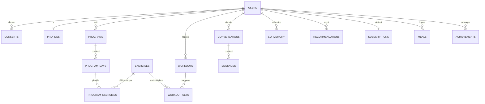

# 03 — Modèle de données

> Statut : 🟡 cible · Moteur : PostgreSQL 16 (+ TimescaleDB, pgvector)

Principes : **normalisation** sur le transactionnel, **append-only** sur la télémétrie, **minimisation** sur la donnée de santé (voir `07`). Tout identifiant est un `uuid v7` (ordonnable dans le temps).

---

## 1. Schéma logique (entités principales)



---

## 2. Tables transactionnelles (PostgreSQL)

### Identity

```sql
-- Utilisateur : strictement le minimum d'identité
create table users (
  id            uuid primary key default uuid_generate_v7(),
  email         citext unique not null,
  auth_provider text not null,              -- 'password' | 'apple' | 'google'
  status        text not null default 'active',
  created_at    timestamptz not null default now(),
  deleted_at    timestamptz                 -- soft-delete (purge RGPD planifiée)
);

-- Profil : données d'usage (séparé pour cloisonner la santé)
create table profiles (
  user_id       uuid primary key references users(id) on delete cascade,
  display_name  text,
  locale        text default 'fr-FR',
  goal          text,                       -- 'muscle' | 'perte' | 'forme' | 'perf'
  lia_tone      smallint not null default 55 check (lia_tone between 0 and 100),
  level         text default 'beginner'
);

-- Consentements : un enregistrement par finalité (preuve RGPD)
create table consents (
  id           uuid primary key default uuid_generate_v7(),
  user_id      uuid not null references users(id) on delete cascade,
  purpose      text not null,               -- 'health_processing' | 'camera' | 'marketing'...
  granted      boolean not null,
  version      text not null,               -- version de la politique acceptée
  occurred_at  timestamptz not null default now()
);
```

### Training

```sql
create table exercises (
  id           uuid primary key default uuid_generate_v7(),
  slug         text unique not null,        -- 'back-squat'
  name         text not null,
  muscle_group text not null,
  modality     text not null,               -- 'barbell' | 'machine' | 'bodyweight'...
  embedding    vector(1024)                 -- pgvector : similarité / substitution
);

create table programs (
  id          uuid primary key default uuid_generate_v7(),
  user_id     uuid not null references users(id) on delete cascade,
  block       text,                         -- 'Force', 'Hypertrophie'...
  week_index  smallint,
  status      text not null default 'active',
  generated_by text not null default 'lia', -- traçabilité IA
  version     integer not null default 1,   -- versionné à chaque adaptation
  created_at  timestamptz not null default now()
);

create table program_exercises (
  id            uuid primary key default uuid_generate_v7(),
  program_day_id uuid not null,
  exercise_id   uuid not null references exercises(id),
  sets_target   smallint,
  reps_target   smallint,
  load_target   numeric(6,2),               -- kg
  rest_seconds  smallint,
  order_index   smallint
);

create table workouts (
  id           uuid primary key default uuid_generate_v7(),
  user_id      uuid not null references users(id) on delete cascade,
  program_id   uuid references programs(id),
  started_at   timestamptz not null,
  ended_at     timestamptz,
  source        text not null default 'app' -- 'app' | 'manual' | 'import'
);

-- Append-only : une ligne par série réalisée
create table workout_sets (
  id           uuid primary key default uuid_generate_v7(),
  workout_id   uuid not null references workouts(id) on delete cascade,
  exercise_id  uuid not null references exercises(id),
  set_index    smallint,
  reps_done    smallint,
  load_kg      numeric(6,2),
  rpe          numeric(3,1),                -- ressenti d'effort 1-10
  form_score   numeric(3,1),               -- qualité de forme (vision on-device)
  counted_by   text default 'vision',      -- 'vision' | 'manual'
  recorded_at  timestamptz not null default now()
);
```

### LIA

```sql
create table conversations (
  id          uuid primary key default uuid_generate_v7(),
  user_id     uuid not null references users(id) on delete cascade,
  created_at  timestamptz not null default now()
);

create table messages (
  id              uuid primary key default uuid_generate_v7(),
  conversation_id uuid not null references conversations(id) on delete cascade,
  role            text not null,            -- 'user' | 'assistant' | 'system'
  content         text not null,
  tone_at_send    smallint,                 -- ton appliqué (audit)
  model           text,                     -- modèle utilisé (audit IA)
  tokens_in       integer,
  tokens_out      integer,
  created_at      timestamptz not null default now()
);

-- Mémoire long terme de LIA (faits saillants, préférences) — vectorisée
create table lia_memory (
  id          uuid primary key default uuid_generate_v7(),
  user_id     uuid not null references users(id) on delete cascade,
  kind        text not null,               -- 'preference' | 'injury' | 'milestone'
  content     text not null,
  embedding   vector(1024),
  expires_at  timestamptz,                 -- oubli programmé (minimisation)
  created_at  timestamptz not null default now()
);

create table recommendations (
  id          uuid primary key default uuid_generate_v7(),
  user_id     uuid not null references users(id) on delete cascade,
  type        text not null,               -- 'load_adjust' | 'deload' | 'substitution'
  payload     jsonb not null,
  rationale   text,                        -- explication lisible (transparence)
  status      text not null default 'proposed', -- 'proposed' | 'accepted' | 'rejected'
  created_at  timestamptz not null default now()
);
```

### Billing

```sql
create table subscriptions (
  user_id      uuid primary key references users(id) on delete cascade,
  plan         text not null default 'free',   -- 'free' | 'premium' | 'coach_plus'
  provider     text,                            -- 'stripe' | 'revenuecat'
  status       text not null,                   -- 'active' | 'trialing' | 'canceled'
  renews_at    timestamptz
);

-- Droits dérivés (cache applicatif des features ouvertes)
create table entitlements (
  user_id      uuid references users(id) on delete cascade,
  feature      text not null,                   -- 'lia_realtime' | 'unlimited_programs'...
  primary key (user_id, feature)
);
```

---

## 3. Télémétrie (TimescaleDB)

Les métriques à fort volume vivent dans des **hypertables** (partitionnées par temps), séparées du transactionnel :

```sql
create table body_metrics (
  user_id     uuid not null,
  metric      text not null,        -- 'weight' | 'resting_hr' | 'sleep_hours'
  value       numeric not null,
  measured_at timestamptz not null
);
select create_hypertable('body_metrics', 'measured_at');

-- Agrégats continus pour les courbes de progrès (pré-calculés)
create materialized view weekly_volume
with (timescaledb.continuous) as
select user_id,
       time_bucket('7 days', recorded_at) as week,
       sum(reps_done * load_kg) as volume_kg
from workout_sets
group by user_id, week;
```

**Rétention** : compression au-delà de 90 jours, agrégats conservés, données brutes purgées selon la politique (voir `07`).

---

## 4. Classification des données

| Catégorie | Exemples | Sensibilité | Traitement |
|-----------|----------|-------------|------------|
| Identité | email, auth | Moyenne | Chiffré, accès restreint |
| **Santé** | poids, FC, sommeil, RPE, forme | **Élevée (art. 9 RGPD)** | Consentement explicite, chiffrement, hébergement HDS |
| Comportement | séances, streaks | Moyenne | Pseudonymisable pour l'analytique |
| Vidéo (caméra) | flux de la séance | **Très élevée** | **Jamais persistée, jamais transmise** (on-device) |
| IA | messages, mémoire | Élevée | Minimisation, oubli programmé, audit |
| Facturation | abonnement | Moyenne | Délégué au PSP (Stripe), pas de carte stockée |

---

## 5. Règles d'or

- **Cloisonnement** `users` ⟂ santé : le profil santé est séparable et chiffrable indépendamment.
- **Soft-delete + purge** : `deleted_at` puis purge complète asynchrone (droit à l'effacement).
- **Audit** : tout accès à la donnée de santé est journalisé (`access_log`, voir `06`).
- **Pas de PII dans les logs applicatifs** ni dans les prompts envoyés au LLM (pseudonymisation).
