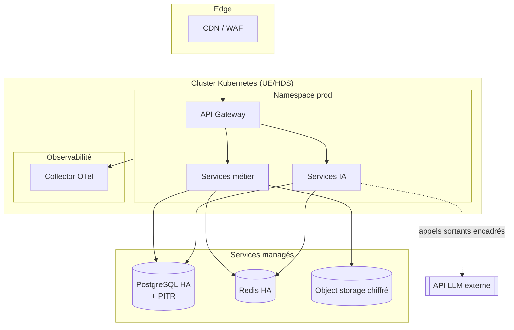
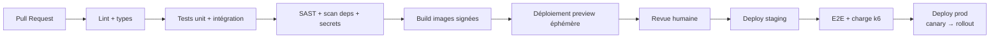

# 04 — Infrastructure & DevOps

> Statut : 🟡 cible · Voir contraintes d'hébergement santé dans `07`

---

## 1. Choix d'hébergement : UE & HDS

La donnée de santé impose un **hébergeur certifié HDS** (Hébergeur de Données de Santé) et une **localisation UE**. Candidats (ADR-0001) :

| Option | HDS | Souveraineté | Maturité Kubernetes/managé | Remarque |
|--------|-----|--------------|----------------------------|----------|
| **OVHcloud** | ✅ certifié | 🇫🇷 forte | bonne | Souverain, bon rapport coût |
| **Scaleway** | ✅ | 🇫🇷 forte | bonne | Écosystème dev agréable |
| **AWS (régions UE)** | ⚠️ via clauses/HDS partner | moyenne | excellente | Riche mais vigilance transferts hors-UE |

> Recommandation MVP : **OVHcloud ou Scaleway** (HDS natif, souveraineté), quitte à isoler des charges non-sensibles ailleurs. Décision en ADR-0001.

---

## 2. Topologie cible

- **Kubernetes managé** (un seul cluster au départ, multi-AZ) ; namespaces `prod` / `staging`.
- **Bases managées** (PG HA + PITR, Redis HA) plutôt qu'auto-gérées : moins d'ops, sauvegardes incluses.
- **Egress contrôlé** : seuls les services IA peuvent appeler le LLM, via une passerelle sortante journalisée.

---

## 3. Environnements

| Env | Usage | Données | Accès |
|-----|-------|---------|-------|
| `local` | dev | mockées / seed | dev |
| `preview` | par PR (éphémère) | synthétiques | équipe |
| `staging` | pré-prod, e2e, charge | anonymisées | équipe |
| `prod` | production | réelles (HDS) | restreint, MFA, just-in-time |

**Aucune donnée de prod en staging/local.** Les jeux de test sont **synthétiques** ou anonymisés.

---

## 4. CI/CD

- **GitHub Actions** pour le backend/web ; **EAS Build/Submit** pour les apps mobiles.
- **Images signées** (cosign) + SBOM ; déploiement **canary** puis montée progressive.
- **Migrations DB** jouées en étape dédiée, réversibles, vérifiées (pas de lock long).
- **Feature flags** (Unleash/Flagsmith) : tout nouveau comportement IA est activable/désactivable sans redéploiement.
- **Mobile OTA** (EAS Update) pour les correctifs JS hors review store.

---

## 5. Infrastructure as Code

- **Terraform** : réseau, clusters, bases, IAM, buckets, secrets — tout en PR revue.
- **Helm** : déploiement des services applicatifs.
- **Secrets** : gestionnaire dédié (Vault / secrets cloud + KMS), **jamais** dans le repo ; rotation automatisée.

---

## 6. Observabilité

| Pilier | Outil | Usage |
|--------|-------|-------|
| Traces | OpenTelemetry → Tempo | Suivre une requête de bout en bout (incl. appels LLM) |
| Logs | Loki | Logs structurés, **sans PII** |
| Métriques | Prometheus → Grafana | Latence, taux d'erreur, saturation |
| IA | Dashboards dédiés | Coût/tokens par requête, latence LLM, taux de garde-fous déclenchés |
| Alerting | Grafana OnCall / PagerDuty | Astreinte sur SLO |

**SLO de référence** : Séance live 99,9 % · API 99,5 % · p95 API < 300 ms · p95 chat LIA < 3 s (first token).

---

## 7. Sauvegarde & PRA

- **PITR** PostgreSQL (restauration à la seconde), sauvegardes chiffrées multi-AZ.
- **RPO ≤ 5 min**, **RTO ≤ 1 h** (cible MVP, à durcir).
- **Exercices de restauration** trimestriels documentés.
- Stockage objets : versioning + réplication.

---

## 8. Scalabilité

- **Stateless** côté services → autoscaling horizontal (HPA sur CPU + métriques custom : connexions WS, profondeur de file IA).
- **IA scalée indépendamment** : c'est le poste le plus élastique (pics du soir, après le travail).
- **Cache agressif** des réponses LIA fréquentes et des agrégats de progrès.
- Passage **BullMQ → Kafka** quand le volume d'événements le justifie (pas avant).
