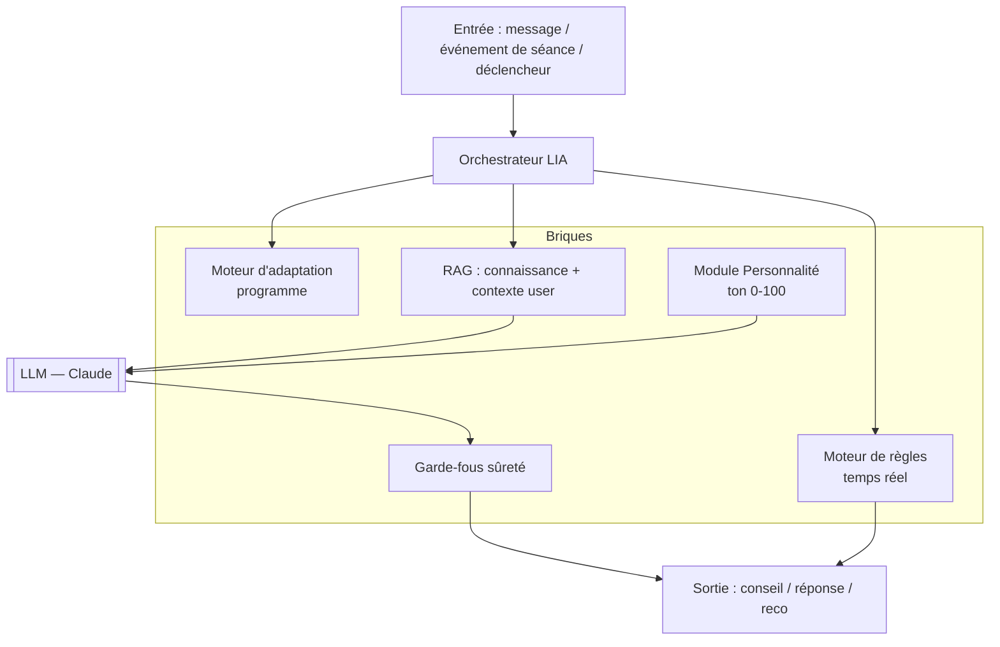
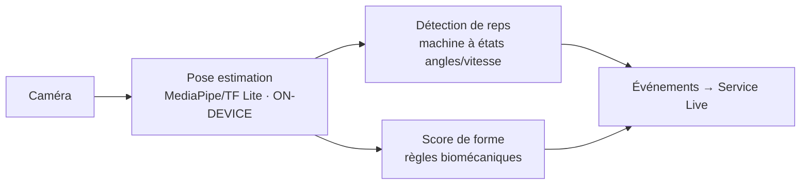

# 05 — IA : LIA

> Statut : 🟡 cible · Le différenciateur produit. Voir sûreté dans `06` et encadrement dans `07`.

LIA n'est pas « un chatbot ». C'est un **système IA composite** : un orchestrateur qui combine des règles temps réel, un moteur d'adaptation, du RAG et un LLM, avec des **garde-fous** et une **personnalité réglable**.

---

## 1. Composants



| Brique | Rôle | Techno |
|--------|------|--------|
| **Règles temps réel** | Conseils en séance à faible latence (repos, tempo, sécurité) | Moteur déterministe (pas de LLM dans la boucle critique) |
| **Adaptation** | Charges/volume/deload selon perfs & RPE | Heuristiques d'abord (progressions validées), ML ensuite |
| **RAG** | Récupère science de l'entraînement + contexte utilisateur | pgvector + embeddings |
| **Personnalité** | Module le ton sans changer le fond | Prompt système paramétré |
| **Garde-fous** | Filtre médical, blessure, contenu | Classifieurs + règles |
| **LLM** | Langage naturel, nuance, synthèse | API Claude (+ fallback) |

---

## 2. Pourquoi cette séparation

- **Latence** : en séance, le conseil doit tomber en < 200 ms perçus → **règles déterministes**, pas d'appel LLM synchrone. Le LLM enrichit/raffine *après*, de façon asynchrone.
- **Sûreté & coût** : le LLM ne décide jamais seul d'une charge ou d'un point médical ; il **habille** une décision prise par des briques contrôlables. On limite aussi le nombre de tokens.
- **Explicabilité** : chaque recommandation porte une `rationale` lisible (transparence — voir `07`).

---

## 3. Comptage de répétitions & analyse de forme (Vision)



- **100 % on-device** par défaut : le **flux vidéo ne quitte jamais le téléphone**. Seuls partent des **métriques dérivées** (nombre de reps, score de forme, tempo). C'est un choix **vie privée + latence + coût** (pas d'inférence vidéo serveur).
- **Détection de reps** : machine à états sur les angles articulaires et la vitesse (phase concentrique/excentrique), calibrée par exercice.
- **Fallback serveur** (`VISION`, optionnel) : appareils trop faibles ou analyse fine *a posteriori*, **avec consentement explicite** et sans stockage du flux.
- Limites assumées : précision variable selon angle de caméra / luminosité → toujours un **réglage manuel** possible.

---

## 4. Personnalité réglable (Bienveillant ↔ Intense)

Le curseur `lia_tone` (0–100) **ne change pas les faits**, seulement le registre.

```
tone < 34  → Bienveillant : soutien, validation, faible pression
34–66      → Équilibré : factuel, encourageant
> 66       → Intense : exigeant, direct, mobilisateur
```

Implémentation : un **prompt système paramétré** (style, longueur, lexique, niveau de pression) injecté avant le contexte. Le ton est **journalisé** (`messages.tone_at_send`) pour audit et cohérence. Garde-fou : même en mode *Intense*, jamais de dévalorisation ni d'injonction risquée (filtre).

---

## 5. RAG & mémoire

- **Base de connaissance** : science de l'entraînement, fiches exercices, nutrition — vectorisée, curée, **sourcée**.
- **Contexte utilisateur** : perfs récentes, objectif, blessures déclarées, préférences (`lia_memory`).
- **Mémoire à oubli programmé** : chaque souvenir a un `expires_at` (minimisation) ; l'utilisateur peut consulter et effacer sa mémoire LIA.
- **Anti-injection** : le contenu récupéré est traité comme **données**, jamais comme instructions (séparation stricte system/context).

---

## 6. Sûreté de l'IA (AI safety)

| Risque | Parade |
|--------|--------|
| Conseil **médical** (douleur, pathologie) | Détection → réponse de prudence + orientation vers un professionnel ; jamais de diagnostic |
| **Blessure** aggravée | Règles de charge plafonnées, deload proactif, signal « stop » prioritaire |
| **Troubles alimentaires** | Détection de signaux → ton protecteur, pas d'objectif de poids agressif, ressources d'aide |
| **Hallucination** | Réponses ancrées RAG + sources ; faible « température » sur le factuel |
| **Injection de prompt** | Cloisonnement system/contexte, allow-list d'outils |
| **Biais / ton blessant** | Filtre de sortie, garde-fou même en mode Intense |
| **Données dans le prompt** | Pseudonymisation : aucun email/identifiant direct envoyé au LLM |

> **Principe** : LIA assiste, n'autorise pas. Toute reco à impact (charge lourde, deload, nutrition restrictive) est **proposée**, expliquée, et **validée par l'utilisateur**.

---

## 7. Choix & coûts des modèles (ADR-0003)

- **MVP** : **API Claude** (qualité + sûreté + tool-use), avec un **routeur de modèles** : petit modèle pour les tâches simples (reformulation, classification), grand modèle pour le coaching nuancé.
- **Optimisations coût** (détaillées dans `08`) : cache de réponses, *prompt caching*, réponses à base de règles quand le LLM n'apporte rien, plafonds de tokens.
- **Piste souveraineté** : modèle open-weight auto-hébergé pour une partie du trafic (coût/contrôle), évalué en phase 2.

---

## 8. Évaluation & qualité

- **Jeux d'évaluation** : scénarios coaching (sûreté, pertinence, ton) rejoués à chaque changement de prompt/modèle.
- **Garde-fous testés** : corpus de cas médicaux/TCA → taux de bonne prise en charge suivi comme métrique.
- **Boucle de feedback** : 👍/👎 utilisateur + signalement → amélioration des prompts et de la base RAG.
- **Supervision humaine** : back-office pour inspecter (échantillon) les conversations à risque, dans le respect de la confidentialité.
