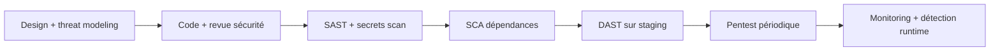

# 06 — Sécurité

> Statut : 🟡 cible · La donnée de santé élève le niveau d'exigence (voir `07`).

Approche : **defense in depth** + **privacy by design**. La surface la plus sensible (vidéo, santé) est neutralisée à la source (traitement on-device, minimisation).

---

## 1. Authentification & accès

| Sujet | Décision |
|-------|----------|
| Protocole | **OAuth2 / OIDC** (Auth0 ou Keycloak — ADR-0002) |
| Connexion | Email+mot de passe (Argon2id), **Sign in with Apple / Google** |
| MFA | TOTP/WebAuthn, **obligatoire** pour staff & comptes Coach+ |
| Sessions | JWT courts (15 min) + refresh tokens rotatifs, révocables |
| Mobile | Tokens en **Keychain/Keystore** (stockage sécurisé matériel) |
| Autorisation | **RBAC** + vérification de propriété (un user n'accède qu'à ses données) |
| Accès staff prod | **Just-in-time**, nominatif, MFA, journalisé, expirant |

---

## 2. Chiffrement

- **En transit** : TLS 1.3 partout, HSTS, certificate pinning sur mobile.
- **Au repos** : chiffrement disque (bases, volumes, S3) via **KMS**, clés gérées et tournées.
- **Application-level** : chiffrement supplémentaire des champs de **santé** les plus sensibles (enveloppe par KMS), pour que la base seule ne suffise pas.
- **Vidéo** : non concernée — **jamais stockée ni transmise** (traitement on-device, voir `05`).
- **Secrets** : Vault / secrets cloud + KMS ; rotation auto ; zéro secret en clair dans le code ou les images.

---

## 3. Cloisonnement & réseau

- Réseau **privé** par défaut ; exposition uniquement via la gateway derrière **WAF + CDN**.
- **Egress filtré** : seuls les services IA appellent le LLM, par une passerelle sortante journalisée (allow-list).
- Séparation stricte `prod` / `staging` (comptes, réseaux, clés distincts).
- **Principe du moindre privilège** sur tous les rôles IAM et accès DB.

---

## 4. Protection applicative

| Menace | Parade |
|--------|--------|
| Injection (SQL/NoSQL) | ORM paramétré, validation d'entrée (Zod/Pydantic) |
| XSS / CSRF | Échappement, CSP stricte, tokens anti-CSRF, cookies `SameSite` |
| Abus d'API | Rate-limiting (Redis), quotas par plan, détection d'anomalies |
| Abus IA (coût/contenu) | Quotas de tokens par user, garde-fous (voir `05`), anti-injection |
| Bots / fraude | WAF, challenge progressif, vérif. d'achat in-app côté serveur |
| Fuite via logs | **Aucune PII dans les logs** ; scrubbing automatique |
| Dépendances | SCA (scan deps), SBOM, mises à jour suivies (Renovate) |
| Images | Scan de vulnérabilités, images signées (cosign) |

---

## 5. Sécurité de la donnée de santé

1. **Minimisation** — on ne collecte que ce qui sert une finalité explicite.
2. **Cloisonnement** — table santé séparée, chiffrée au niveau champ, accès tracé.
3. **Journal d'accès** — toute lecture/écriture de donnée de santé est enregistrée (`access_log` : qui, quoi, quand, pourquoi), conservé et auditable.
4. **Pseudonymisation** — l'analytique et les prompts LLM ne voient jamais d'identifiant direct.
5. **Hébergement HDS / UE** — voir `04` et `07`.

---

## 6. SSDLC (cycle de dev sécurisé)

- **Threat modeling** sur chaque domaine sensible (séance, santé, IA).
- **Pentest** externe avant lancement, puis annuel + à chaque changement majeur.
- **Programme de divulgation** (responsible disclosure) dès le lancement public.

---

## 7. Réponse à incident

- **Runbooks** par type d'incident (fuite de données, compromission, abus IA).
- **Détection** : alertes sur accès anormaux, exfiltration, pics d'erreurs.
- **Notification** : procédure de notification CNIL **< 72 h** en cas de violation de données personnelles (obligation RGPD), et information des personnes si risque élevé.
- **Post-mortem** sans blâme, actions correctives suivies.

---

## 8. Checklist pré-lancement (extrait)

- [ ] Pentest externe passé, criticités corrigées
- [ ] Chiffrement champ santé + rotation KMS vérifiés
- [ ] MFA staff + accès JIT prod actifs
- [ ] Journal d'accès santé opérationnel et testé
- [ ] Aucune PII dans logs / prompts (audit automatisé)
- [ ] Procédure violation de données répétée (exercice)
- [ ] Contrat HDS signé, sous-traitants cartographiés (voir `07`)
