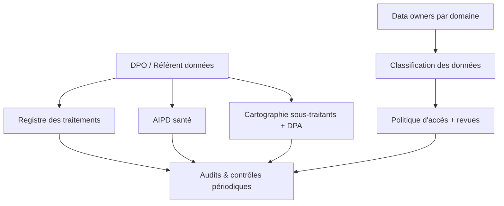

# 07 — Conformité & gouvernance

> Statut : 🟡 cible · ⚠️ Ce document est une **base de cadrage**, pas un avis juridique. Faire valider par un DPO / conseil spécialisé avant lancement.

Mia traite de la **donnée de santé** (art. 9 RGPD), ce qui déclenche des obligations renforcées : base légale explicite, hébergement HDS, AIPD, gouvernance.

---

## 1. Cadre applicable

| Cadre | Pourquoi | Impact principal |
|-------|----------|------------------|
| **RGPD** | Données personnelles UE | Bases légales, droits, registre, AIPD |
| **Donnée de santé (art. 9)** | Poids, FC, sommeil, perf, forme | Consentement explicite, garanties renforcées |
| **HDS** (Hébergement Données de Santé) | Hébergement de santé en France | Hébergeur certifié HDS obligatoire |
| **ePrivacy / cookies** | Web & tracking | Consentement traceurs, CMP |
| **AI Act (UE)** | Système d'IA | Transparence, gestion des risques (LIA = risque limité a priori) |
| **DSA / stores** | Distribution app | Règles Apple/Google (santé, abonnements) |

---

## 2. Bases légales (par finalité)

| Finalité | Base légale | Note |
|----------|-------------|------|
| Création de compte, fourniture du service | **Exécution du contrat** | — |
| Traitement de **données de santé** (suivi, coaching) | **Consentement explicite** (art. 9.2.a) | Granulaire, révocable |
| Caméra / analyse de forme | **Consentement explicite** distinct | Activable/désactivable |
| Amélioration produit / analytics | **Intérêt légitime** ou consentement | Données pseudonymisées |
| Marketing | **Consentement** | Opt-in, retrait simple |
| Personnalisation IA (LIA) | **Consentement** | Transparence sur le fonctionnement |

> Chaque consentement est **enregistré, versionné et horodaté** (table `consents`), preuve à l'appui.

---

## 3. Principes RGPD appliqués

1. **Minimisation** — collecte limitée à la finalité ; pas de donnée « au cas où ».
2. **Limitation de finalité** — la donnée de santé ne sert pas à autre chose que le coaching sans nouveau consentement.
3. **Limitation de conservation** — politique de rétention claire (§5).
4. **Exactitude** — l'utilisateur corrige ses données (poids, objectifs…).
5. **Privacy by design & by default** — vidéo on-device, options les moins intrusives par défaut.
6. **Transparence** — politique lisible + explication du fonctionnement de LIA.

---

## 4. Droits des personnes

| Droit | Mise en œuvre |
|-------|---------------|
| Accès | Export self-service (JSON + lisible) |
| Rectification | Édition dans l'app |
| **Effacement** | Suppression de compte → soft-delete puis **purge complète** (incl. mémoire LIA) sous délai défini |
| Portabilité | Export structuré (workouts, métriques) |
| Opposition / retrait | Désactivation par finalité (santé, caméra, IA, marketing) |
| Décision automatisée | Les recos LIA sont **proposées**, jamais imposées → pas de décision automatisée à effet juridique |

**SLA droits** : réponse ≤ 1 mois (RGPD). Procédures outillées pour tenir le délai.

---

## 5. Politique de rétention

| Donnée | Conservation | À l'issue |
|--------|--------------|-----------|
| Compte actif | Durée de la relation | — |
| Compte inactif | 24 mois sans connexion | Notification puis suppression |
| Métriques de santé brutes | 90 j chaud → compressé | Agrégats conservés, brut purgé |
| Vidéo caméra | **0** (jamais stockée) | — |
| Messages LIA | 12 mois (paramétrable) | Anonymisation/suppression |
| Mémoire LIA | `expires_at` par item | Oubli programmé |
| Logs techniques | 30–90 j | Sans PII, puis purge |
| Journal d'accès santé | Durée légale | Conservé pour audit |
| Facturation | Obligation comptable (~10 ans) | Conservé (PSP) |

---

## 6. Gouvernance de la donnée

- **DPO / référent** désigné ; **registre des traitements** tenu à jour.
- **AIPD** (Analyse d'Impact) **obligatoire** vu le traitement de santé à grande échelle — réalisée avant lancement.
- **Sous-traitants** (LLM, hébergeur, PSP, analytics) : cartographiés, **DPA signés**, garanties de transfert vérifiées.
- **Data owners** par domaine ; revues d'accès trimestrielles.

---

## 7. Transferts hors UE & IA

- **Hébergement** : UE / HDS (voir `04`).
- **LLM** : privilégier un traitement **UE** / clauses contractuelles types (CCT) si transfert ; **aucune PII directe** dans les prompts (pseudonymisation systématique) ; **pas de réutilisation** des données pour entraîner des modèles tiers (clause contractuelle).
- **AI Act** : LIA relève a priori du **risque limité** → obligations de **transparence** (l'utilisateur sait qu'il parle à une IA), documentation, gestion des risques. Réévaluer si évolution réglementaire.

---

## 8. Limites & posture santé

- LIA **n'est pas un dispositif médical** et ne fournit **aucun diagnostic** ni traitement. Positionnement « bien-être / sport », communiqué clairement (évite la qualification de dispositif médical et ses obligations).
- Garde-fous produits (voir `05`/`06`) : orientation vers un professionnel de santé en cas de signal médical.
- Mentions claires : « LIA est un assistant de coaching sportif, pas un avis médical ».

---

## 9. Checklist conformité (extrait)

- [ ] AIPD santé réalisée et validée
- [ ] Registre des traitements complet
- [ ] Hébergeur HDS contractualisé
- [ ] DPA signés avec tous les sous-traitants (LLM inclus)
- [ ] Parcours de consentement granulaire + preuve
- [ ] Droits (accès/effacement/portabilité) outillés et testés
- [ ] Politique de rétention implémentée techniquement
- [ ] Mentions IA & non-médical visibles
- [ ] Procédure de notification de violation < 72 h
