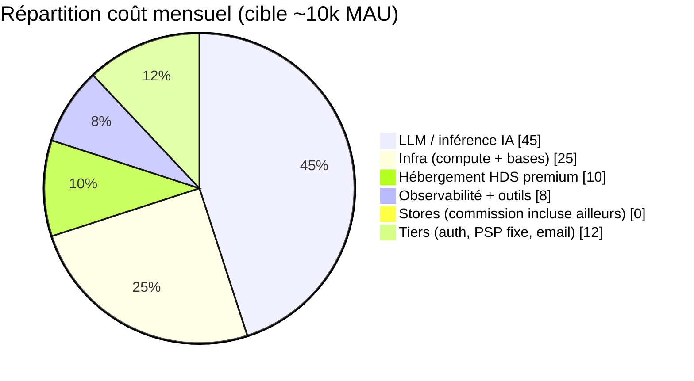
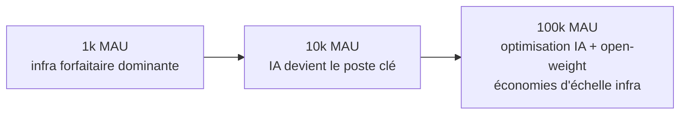

# 08 — Coûts & unit economics

> Statut : 🔵 estimations de cadrage · ⚠️ Ordres de grandeur à **valider avec la charge réelle**. Devises en € HT, hypothèses explicites.

L'enjeu : le **coût variable dominant est l'inférence IA (LLM)**. L'infrastructure classique reste modeste à l'échelle MVP. La rentabilité dépend du **coût IA par utilisateur actif** vs l'ARPU.

---

## 1. Postes de coût

> La **vidéo n'a aucun coût serveur** (traitement on-device) — choix d'architecture qui élimine le poste le plus cher d'une analyse vidéo classique.

---

## 2. Hypothèses (cible MVP ~10 000 MAU)

| Hypothèse | Valeur |
|-----------|--------|
| Utilisateurs actifs mensuels (MAU) | 10 000 |
| Part payante (Premium) | 6 % → 600 abonnés |
| Prix Premium | 14,99 € / mois |
| Messages LIA / user payant / mois | ~120 |
| Tokens moyens / échange (in+out) | ~1 500 |
| % d'échanges traités **sans LLM** (règles/cache) | 40 % |
| Routage petit modèle / grand modèle | 70 % / 30 % |

---

## 3. Coût IA (le poste clé)

Le coût LLM se pilote par **3 leviers** :

1. **Éviter le LLM** quand inutile — 40 % des interactions (conseils de séance, FAQ fréquentes) sont servies par **règles + cache**, à coût ~0.
2. **Router les modèles** — petit modèle (classification, reformulation) pour la majorité ; grand modèle réservé au coaching nuancé.
3. **Prompt caching** — le contexte système/personnalité (stable) est mis en cache → réduction forte des tokens facturés.

**Estimation (ordre de grandeur)** : avec ces optimisations, **~0,30–0,80 € / utilisateur payant / mois** de coût LLM. Sans optimisation (tout au grand modèle, sans cache), on monterait facilement à **3–6 €** — d'où l'importance de l'architecture composite de `05`.

> Ces fourchettes dépendent fortement des tarifs du fournisseur et de l'usage réel. À instrumenter dès le MVP (coût/tokens par requête est une métrique de premier ordre, voir `04`).

---

## 4. Coût infrastructure (ordre de grandeur, ~10k MAU)

| Poste | Estimation mensuelle |
|-------|----------------------|
| Cluster Kubernetes (multi-AZ, taille modeste) | 400 – 900 € |
| PostgreSQL managé HA + PITR | 250 – 600 € |
| Redis managé HA | 80 – 200 € |
| Stockage objets + egress | 50 – 200 € |
| **Surcoût HDS** (hébergeur certifié) | +10 – 25 % sur l'infra |
| Observabilité (logs/traces/métriques) | 150 – 400 € |
| CDN / WAF | 50 – 200 € |
| **Sous-total infra** | **~1 000 – 2 500 € / mois** |

| Services tiers | Estimation |
|----------------|-----------|
| Auth managé (si Auth0) | 0 – 500 € selon MAU (Keycloak ≈ coût infra seul) |
| Stripe | ~1,5 % + frais (web) ; **stores 15–30 %** sur l'in-app |
| RevenueCat | gratuit sous seuil, puis % du revenu suivi |
| Email/push transactionnel | 20 – 100 € |
| Builds mobiles (EAS) | 0 – 100 € |

---

## 5. Unit economics (illustratif)

| Métrique | Valeur indicative |
|----------|-------------------|
| ARPU payant brut | 14,99 € |
| − Commission store (moy. ~20 %) | −3,00 € |
| − Coût LLM / payant | −0,50 € |
| − Quote-part infra / payant | −0,40 € |
| **Marge brute / payant** | **~11 €** (≈ 73 %) |

> Le modèle freemium tient **si** : (a) la conversion gratuit→payant dépasse ~4–6 %, et (b) le coût IA des utilisateurs **gratuits** reste contenu (chat LIA **limité** au plan gratuit — c'est aussi un choix produit/coût). Le poste à surveiller : l'IA consommée par les non-payants.

---

## 6. Leviers d'optimisation continue

| Levier | Effet |
|--------|-------|
| Cache + règles avant LLM | −30 à −50 % de coût IA |
| Prompt caching du contexte stable | −20 à −40 % de tokens |
| Routeur de modèles | −40 à −60 % vs tout-grand-modèle |
| Modèle open-weight auto-hébergé (phase 2) | coût marginal ↓ à fort volume, souveraineté ↑ |
| Quotas IA par plan | borne le coût des gratuits |
| Compression télémétrie (Timescale) | −70 % stockage séries temporelles |
| Autoscaling (pics du soir) | paie la capacité au juste besoin |

---

## 7. Évolution du coût avec l'échelle

- À petite échelle : **l'infra fixe domine** (le coût par user est élevé, normal).
- À l'échelle : **l'IA domine** → le ROI des optimisations de `05` devient majeur.
- Très grande échelle : envisager l'**auto-hébergement** d'une partie de l'inférence (ADR-0003).

---

## 8. À instrumenter dès le jour 1

- Coût LLM **par requête, par user, par plan** (dashboard dédié).
- Taux d'interactions servies **sans LLM**.
- Coût IA des **utilisateurs gratuits** (signal d'alerte rentabilité).
- Conversion gratuit→payant et churn (déterminent tout le modèle).
