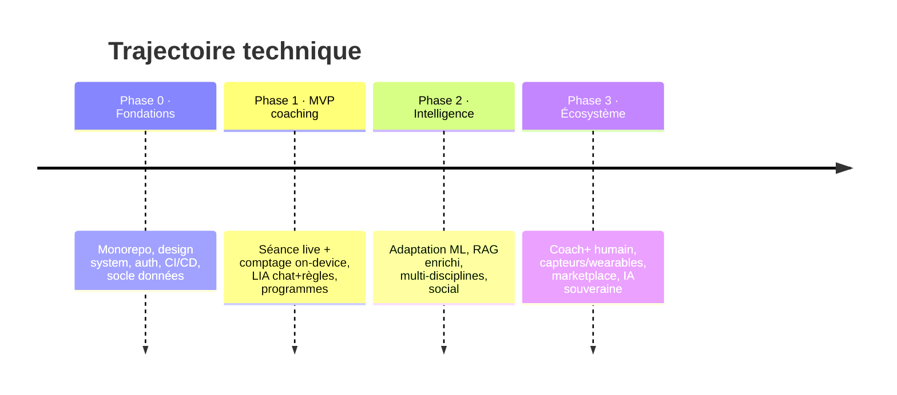

# 09 — Roadmap technique

> Statut : 🟡 cible · Aligne la trajectoire produit (deck stratégique) avec les jalons techniques.

Principe : **livrer une seule discipline parfaitement** (musculation/force) avant d'élargir. Chaque phase débloque la suivante grâce à la donnée accumulée et à la rétention prouvée.

---

## 1. Vue d'ensemble

---

## 2. Phase 0 — Fondations (socle)

**Objectif :** poser un socle sûr et réversible.

- [ ] Monorepo (Turborepo/Nx), TypeScript partout, design system partagé mobile/web
- [ ] Auth OIDC + MFA staff, RBAC
- [ ] Socle données : PostgreSQL + Timescale + pgvector, migrations
- [ ] CI/CD (GitHub Actions + EAS), environnements preview/staging/prod
- [ ] Observabilité OpenTelemetry de base
- [ ] Cadre conformité : registre, consentements, hébergeur HDS contractualisé

**Sortie de phase :** un « hello world » déployable de bout en bout, sécurisé, audité.

---

## 3. Phase 1 — MVP coaching (le cœur)

**Objectif :** prouver la **rétention** sur la musculation avec le coaching temps réel.

| Chantier | Détail |
|----------|--------|
| **Séance live** | WebSocket, repos, conseils par **règles** (latence), offline-first |
| **Comptage de reps** | Pose estimation **on-device** (MediaPipe/TF Lite), score de forme, fallback manuel |
| **LIA chat** | Orchestrateur + LLM + RAG de base + **personnalité réglable** + garde-fous |
| **Programmes** | Génération + adaptation **heuristique** (progressions validées) |
| **Suivi & progrès** | Télémétrie Timescale, courbes, records, streaks |
| **Nutrition v1** | Macros, repas, reco LIA simple |
| **Abonnements** | Stripe (web) + RevenueCat (in-app), entitlements |

**Garde-fous indispensables avant ouverture publique :** AIPD validée, pentest, journal d'accès santé, procédure violation < 72 h (voir `06`/`07`).

**Métriques de succès :** rétention J30, taux d'assiduité (séances/semaine), conversion gratuit→payant, **coût IA / user**.

---

## 4. Phase 2 — Intelligence (élargir)

**Objectif :** rendre LIA mesurablement plus fine et ouvrir l'usage.

- [ ] **Adaptation ML** : remplacer progressivement les heuristiques par des modèles entraînés sur la donnée accumulée (réponse à l'effort, prédiction de plateau)
- [ ] **RAG enrichi** : base de connaissance étendue, mémoire long terme, meilleures sources
- [ ] **Multi-disciplines** : cardio, mobilité, course (nouvelles machines à états vision)
- [ ] **Social** : défis communautaires, classements (avec consentement/anonymat)
- [ ] **Suggestions proactives** : détection de risques (blessure, démotivation) en amont
- [ ] **Routeur de modèles** affiné + prompt caching (optimisation coût, voir `08`)
- [ ] **Migration BullMQ → Kafka** si le volume d'événements l'exige

**Métriques :** précision des recos (acceptées/rejetées), réduction du coût IA/user, expansion d'usage.

---

## 5. Phase 3 — Écosystème (plateforme)

**Objectif :** Mia devient une plateforme.

- [ ] **Coach+** : connecter de vrais coachs humains à la donnée LIA (bilans, supervision) → nouveau palier de revenu
- [ ] **Wearables & capteurs** : HealthKit/Health Connect approfondis, montres, ceintures FC
- [ ] **Marketplace** de programmes (créateurs, coachs)
- [ ] **IA souveraine** : auto-hébergement d'une partie de l'inférence (coût + souveraineté, ADR-0003)
- [ ] **API partenaires** (salles, marques) sous gouvernance stricte

---

## 6. Dette & risques techniques à surveiller

| Risque | Mitigation |
|--------|-----------|
| Coût IA qui dérape avec l'usage gratuit | Quotas par plan, règles/cache, monitoring coût/user dès J1 |
| Précision vision variable (matériel, lumière) | Fallback manuel, calibration par exercice, tests terrain |
| Dépendance à un fournisseur LLM | Abstraction multi-modèles, piste open-weight (phase 2) |
| Conformité santé sous-estimée | DPO impliqué tôt, AIPD avant lancement, hébergeur HDS dès phase 0 |
| Micro-services prématurés | Rester en monolithe modulaire jusqu'à contrainte réelle |
| Offline/sync complexe | Modèle append-only, idempotence, tests de reconnexion |

---

## 7. Jalons de décision (ADR liés)

| Jalon | Décision | Doc |
|-------|----------|-----|
| Fin Phase 0 | Hébergeur HDS, auth managé vs auto-hébergé | ADR-0001, 0002 |
| Mi Phase 1 | LLM principal + stratégie de routage | ADR-0003 |
| Fin Phase 1 | REST vs GraphQL pour le client à l'échelle | ADR-0004 |
| Phase 2 | Vision 100 % on-device vs hybride | ADR-0005 |
| Phase 3 | Auto-hébergement inférence IA | ADR-0003 (révision) |

---

## 8. Définition de « prêt pour le public »

Un lancement public n'est validé que si **toutes** ces conditions sont réunies :

1. AIPD santé validée + hébergeur HDS contractualisé
2. Pentest externe passé, criticités corrigées
3. Garde-fous IA (médical/TCA/blessure) testés sur corpus dédié
4. Droits RGPD (accès, effacement, portabilité) outillés et testés
5. Monitoring coût IA + SLO séance live en place
6. Procédure de réponse à incident répétée (exercice réel)
